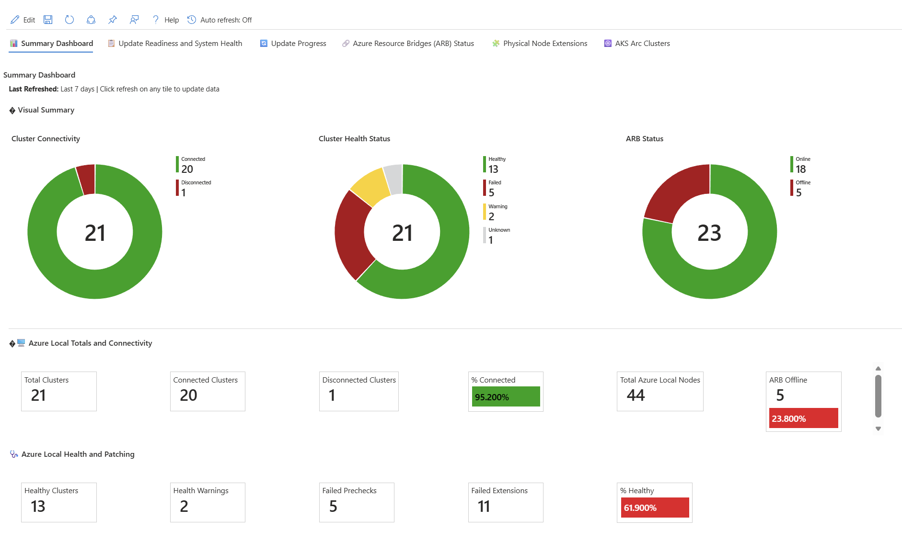
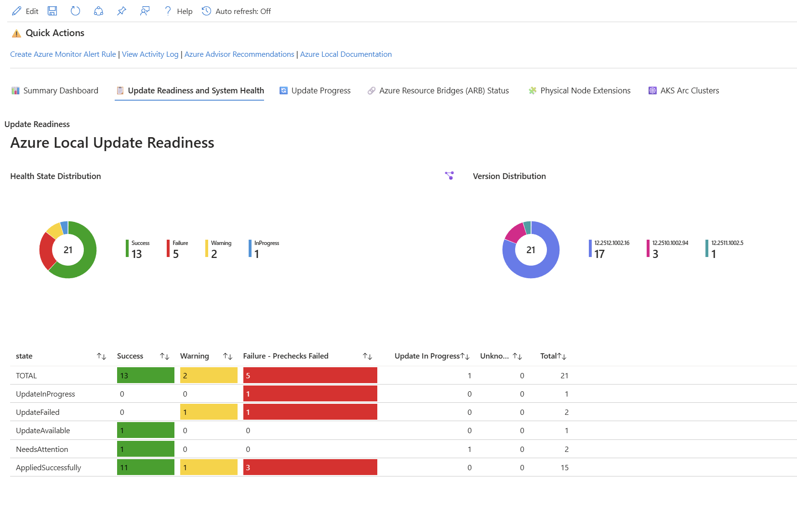
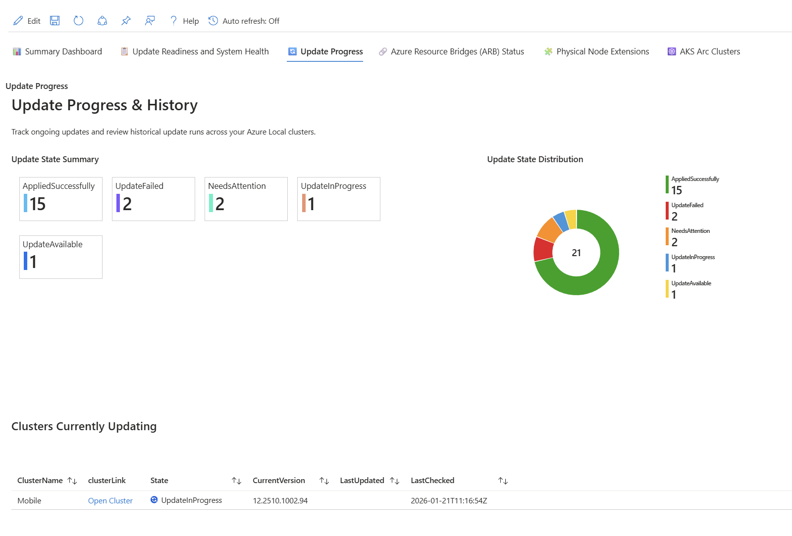
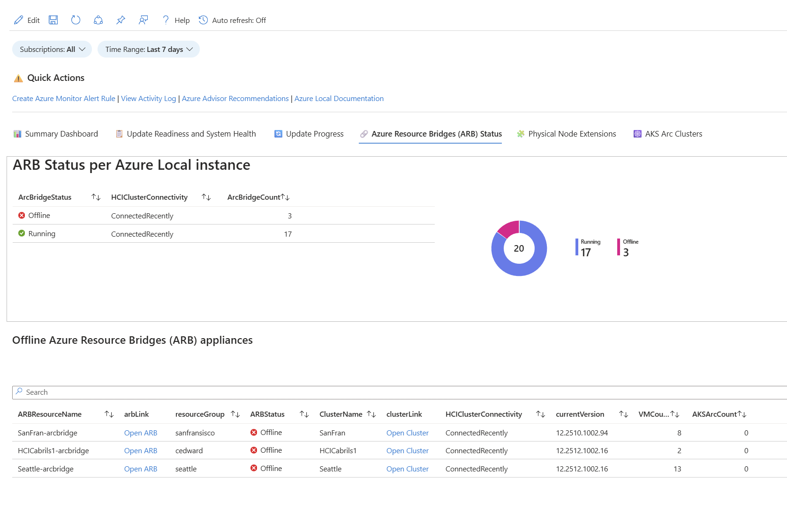
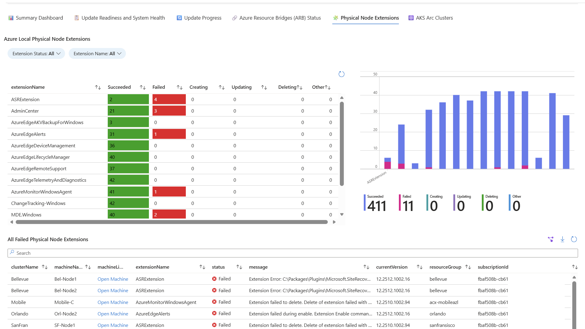
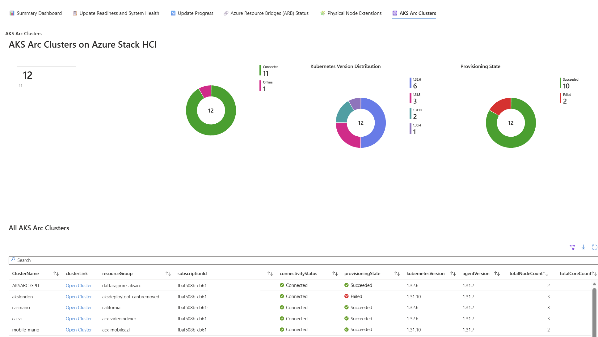

# Azure Local - Managing Updates At Scale Workbook

**Version: v0.3.1**

An Azure Monitor Workbook for monitoring and managing Azure Local (formerly Azure Stack HCI) clusters at scale. This workbook provides comprehensive visibility into cluster health, update readiness, and workload status across your entire Azure Local fleet.

## Overview

This workbook uses Azure Resource Graph queries to aggregate and display real-time information about your Azure Local infrastructure. It's designed to help administrators and operations teams quickly identify issues, track update progress, and maintain overall cluster health across multiple clusters and subscriptions.

## Features

The workbook is organized into seven main tabs:

### 📊 Summary Dashboard
A high-level overview of your entire Azure Local estate, including:
- **Visual Summary Charts**: Pie charts showing cluster connectivity, health status, and Azure Resource Bridge (ARB) status
- **Azure Local Totals and Connectivity**: Tile metrics for total clusters, connected/disconnected clusters, connection percentage, total nodes, and offline ARBs
- **Health and Patching Status**: Healthy clusters, health warnings, failed prechecks, failed extensions, and health percentage
- **Workload Summary**: Total Azure Local VMs and AKS Arc clusters

### 📋 Update Readiness and System Health
Detailed view of cluster update readiness:
- Health state distribution chart
- Version distribution across clusters
- Summary of health states by update status
- Failed prechecks analysis with filtering by cluster, health state, and severity
- Detailed failure reason summaries showing affected clusters and occurrence counts

### 🔄 Update Progress
Track the progress of ongoing updates across your clusters with detailed status information.

### 🔗 Azure Resource Bridges (ARB) Status
Monitor the status of Azure Resource Bridge appliances:
- ARB status summary per Azure Local instance
- Offline ARB appliances with associated cluster information
- Complete list of all ARB appliances with status indicators
- Direct links to open ARB and cluster resources in the Azure portal

### 🧩 Physical Node Extensions
View and manage extensions installed on Azure Local physical nodes:
- Filter by extension status (Succeeded, Failed, Creating, Updating, Deleting)
- Filter by extension name
- Summary table showing extension counts by status
- Detailed list of all node extensions with status indicators

### 💻 Azure Local VMs
Monitor virtual machines running on Azure Local clusters:
- VM status summary tiles showing total VMs and connection status
- VM connection status distribution pie chart
- OS distribution pie chart showing operating system breakdown
- VMs by resource group distribution
- Bar chart showing VM deployments over time with configurable time range (1-24 months)
- Complete list of all VMs with details including OS version, agent version, and last status change
- VMs grouped by hosting Azure Local cluster with counts
- VM distribution bar chart by cluster

### ☸️ AKS Arc Clusters
Monitor AKS Arc clusters running on Azure Local:
- Connectivity status summary and chart
- Kubernetes version distribution
- Provisioning state overview
- Complete list of all AKS Arc clusters with details including node count, core count, and last connectivity time

## Quick Actions

The workbook includes convenient links to:
- Create Azure Monitor Alert Rules
- View Activity Log
- Azure Advisor Recommendations
- Azure Local Documentation

## Parameters

The workbook provides several filtering options to help you focus on specific resources:

### Scope Filters
- **Subscriptions**: Filter data by one or more Azure subscriptions (defaults to all accessible subscriptions)

### Resource Group Filter
- **Resource Group Filter**: Optional wildcard filter for resource group names
  - Use `*` as a wildcard character to match any sequence of characters
  - Examples:
    - `*-prod-*` matches resource groups containing "-prod-" (e.g., "rg-hci-prod-01", "azure-prod-cluster")
    - `*hci*` matches any resource group containing "hci"
    - `rg-*` matches resource groups starting with "rg-"
  - Leave empty to show all resource groups

### Cluster Tag Filter
- **Cluster Tag Name**: The name of the tag to filter by (e.g., "Environment", "Team", "CostCenter")
- **Cluster Tag Value**: The value of the tag to match (e.g., "Production", "IT-Ops")
- **Note**: Tag filtering applies **only to Azure Local clusters** - it does not filter AKS Arc clusters or Azure Local VMs
- Both Tag Name and Tag Value must be provided for the filter to take effect

### Time Range
- **Time Range**: Select the time range for time-based queries (1 day to 30 days, or custom)

## Prerequisites

- Access to Azure subscriptions containing Azure Local clusters
- Reader permissions on the resources you want to monitor
- Azure Monitor Workbooks access in the Azure portal

## How to Import the Workbook

1. **Navigate to Azure Monitor Workbooks**
   - Open the [Azure portal](https://portal.azure.com)
   - Search for "Monitor" in the search bar and select **Monitor**
   - In the left navigation, select **Workbooks**

2. **Create a New Workbook**
   - Click **+ New** to create a new workbook
   - In the empty workbook, click the **Advanced Editor** button (</> icon) in the toolbar

3. **Import the JSON Template**
   - In the Advanced Editor, select the **Gallery Template** tab
   - Delete any existing content in the editor
   - Copy the entire contents of the [`Azure-Workbook_AzLocal-Managing-Updates-At-Scale.json`](https://raw.githubusercontent.com/NeilBird/PowerShell-Snippnets/refs/heads/main/Azure-Local-Manage-Updates-At-Scale/Azure-Workbook_AzLocal-Managing-Updates-At-Scale.json) file
   - Paste the JSON content into the editor
   - Click **Apply**

4. **Save the Workbook**
   - Click **Done Editing** to exit edit mode
   - Click **Save** or **Save As** in the toolbar
   - Provide a name (e.g., "Azure Local - Managing Updates At Scale")
   - Select a subscription, resource group, and location to save the workbook
   - Click **Save**

5. **Pin to Dashboard (Optional)**
   - After saving, you can pin individual tiles or the entire workbook to an Azure dashboard for quick access

## Alternative Import Method

You can also import directly from the Workbooks gallery:

1. Go to **Monitor** > **Workbooks**
2. Click **+ New**
3. Click the **</>** (Advanced Editor) button
4. Select **Gallery Template** tab
5. Paste the JSON content and click **Apply**

## Usage Tips

- Use the subscription filter to focus on specific environments (e.g., production vs. development)
- Regularly check the Update Readiness tab before scheduling maintenance windows
- Monitor the ARB Status tab to ensure Azure Arc connectivity is healthy
- Export data to Excel using the export button on grids for reporting purposes
- Set up Azure Monitor alerts based on the queries in this workbook for proactive monitoring

## Contributing

Feel free to submit issues or pull requests to improve this workbook.

## License

See the repository's LICENSE file for details.
